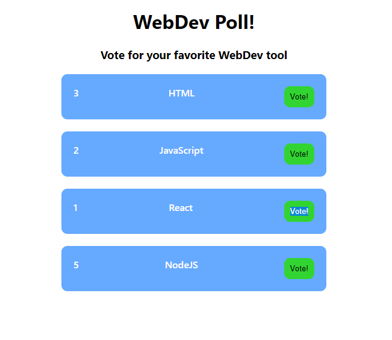

# Poll Web App
The main task for this exercise is to create a small application for you to practice what you have learned in the course. The concept for this web app is to create a small poll where people can vote for their favorite web dev tool. For reference you can look at the image.

## Instructions
### Task 1
- Create the base structure of the small web app. How many components do you think are needed? Use functional components for it.
- Use hooks to handle the counter for each of the web dev tools. Every time the user clicks on a button the corresponding counter should increase by 1.
### Task 2 useEffect
Now that we know about useEffect let's simulate having AJAX calls to an API or Database by using the `localStorage`. We will save the values of the number of votes of each web tool. Normally all these calls are made using the useEffect Hook as making the call is considered a side effect. Also another advantage, is that by making the call after rendering we don't have to wait for the response of the call to render something. Then let's add these features to the poll web app!

- Use an useEffect hook for getting the data from the localStorage if available. Then assign this data to the corresponding counter. This should happen only once after the whole component render for the first time. (HINT: This means that the content of the array that we pass to the useEffect will be different)
- Use another useEffect hook but this time to save the counters each time a change is made. Save it in the `localStorage`. Another useEffect is needed because in this case, we will execute this everytime that we have a change and not only at the beggining.

## Extra
- In the header show which tool has more votes.

## Notes
- You can use the provided css so you don't need to worry about that.